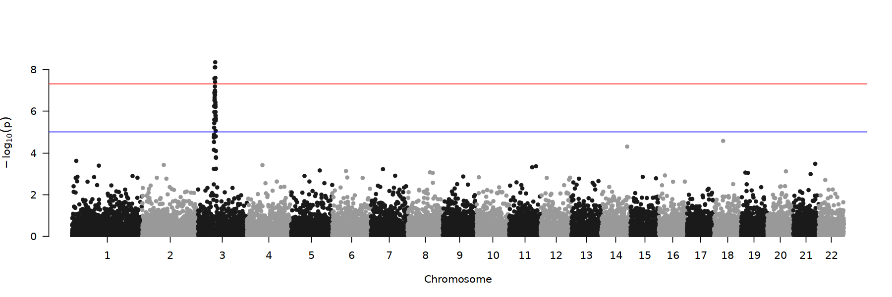
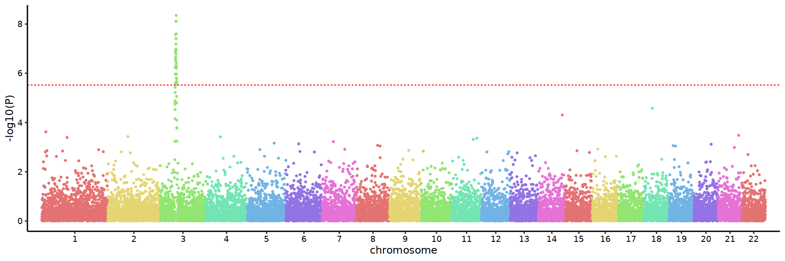

## Millions of SNP data to draw PDF version of Manhattan map (file size 200k,dpi=300)

### First list the advantages of this article:

- More than 21 million SNPS: the original pdf size is 773M, and the pdf size is 203k after the point layer raster.

- 7686395 SNPS: original pdf size 275M, point layer raster pdf size 200k.

- qqman sample data 16470 SNP, original pdf size 853k, point layer raster pdf size 254k


```R
library(tidyverse)
library(ggrastr)
library(qqman)
```


```R
head(gwasResults,3)
```


<table class="dataframe">
<caption>A data.frame: 3 × 4</caption>
<thead>
	<tr><th></th><th scope=col>SNP</th><th scope=col>CHR</th><th scope=col>BP</th><th scope=col>P</th></tr>
	<tr><th></th><th scope=col>&lt;chr&gt;</th><th scope=col>&lt;int&gt;</th><th scope=col>&lt;int&gt;</th><th scope=col>&lt;dbl&gt;</th></tr>
</thead>
<tbody>
	<tr><th scope=row>1</th><td>rs1</td><td>1</td><td>1</td><td>0.9148060</td></tr>
	<tr><th scope=row>2</th><td>rs2</td><td>1</td><td>2</td><td>0.9370754</td></tr>
	<tr><th scope=row>3</th><td>rs3</td><td>1</td><td>3</td><td>0.2861395</td></tr>
</tbody>
</table>


```R
options(repr.plot.width = 15,repr.plot.height = 5)
manhattan(gwasResults)
```


    

    


### Personal data preparation


```R
# demo_data <- read.table("demo.txt",sep = "\t")
demo_data <- gwasResults
colnames(demo_data) <- c("SNP","CHR","POS","P")
```

### Custom function


```R
change_data <- function(p_data){
chr_list <- distinct(p_data,CHR)$CHR
p_data$p_value <- -log10(p_data$P)
p_signal_line <<- -log10(0.05/nrow(p_data))

self_color_all_list <- c(
  "#E57272","#E5D572","#93E572","#72E5B3","#72B3E5","#9372E5","#E672D5","#E57272","#E5D572","#93E572",
  "#72E5B3","#72B3E5","#9372E5","#E672D5","#E57272","#E5D572","#93E572","#72E5B3","#72B3E5","#9372E5",
  "#E672D5","#E57272","#E5D572","#93E572","#72E5B3","#72B3E5","#898989","#E57272","#E5D572","#93E572",
  "#E672D5","#E57272","#E5D572","#93E572","#72E5B3","#72B3E5","#898989","#E57272","#E5D572","#93E572")
    
self_color <<- self_color_all_list[1:length(chr_list)]
max_value_list <- c()
for(i in chr_list){max_value_list[i]=max(subset(p_data,CHR==i)$POS)}
name_x_axis <- chr_list
names(name_x_axis) <- chr_list
value_x_axis <- c(0,cumsum(max_value_list[-length(max_value_list)]))
names(value_x_axis) <- chr_list
final_data <<- data.frame(CHR=p_data$CHR,POS=(p_data$POS+value_x_axis[as.character(p_data$CHR)]),p_value=p_data$p_value)
final_data$CHR <<- factor(final_data$CHR,levels=chr_list)
x_breaks <- function(demo_data,demo){
  min_pos=min(subset(demo_data,CHR == demo)$POS)
  max_pos=max(subset(demo_data,CHR == demo)$POS)
  mean(c(max_pos,min_pos))}
x_break_value <- c()
for(i in chr_list){x_break_value[i]=x_breaks(final_data,i)}
x_break_value <<- x_break_value
names(x_break_value) <<- chr_list
}
```

### run


```R
change_data(demo_data)
```


```R
options(ggrastr.default.dpi=300)
p_self_plot <- ggplot(final_data,aes(x=POS,y=p_value,colour=CHR))+
    rasterise(geom_point(size=1))+
    scale_x_continuous(expand = c(0.02,0.01),breaks=x_break_value,labels=names(x_break_value))+
    geom_hline(yintercept = p_signal_line,linetype="dashed",color="red")+
    scale_color_manual(values = self_color)+
    theme_classic(base_size=14)+
    theme(legend.position='none',
    axis.text.x=element_text(color="black"), 
    axis.text.y=element_text(color="black"))+
    labs(x="chromosome",y="-log10(P)")  
```


```R
options(repr.plot.width = 15,repr.plot.height = 5)
p_self_plot
```


    

    


```R
pdf("/home/xiaolong/demo.qqman.pdf",height=3,width=15)
p_self_plot
dev.off()
```


<strong>png:</strong> 2


- -rw-r--r-- 1 xiaolong xiaolong 254K Sep  3 22:24 demo.qqman.pdf


```R

```
